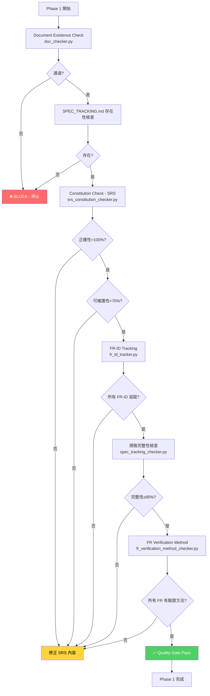
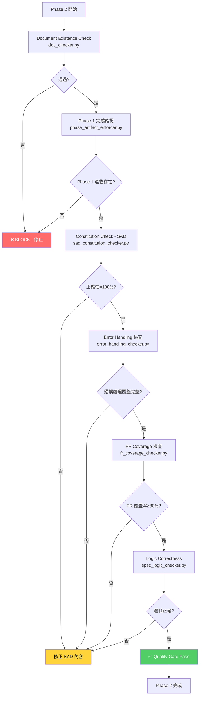
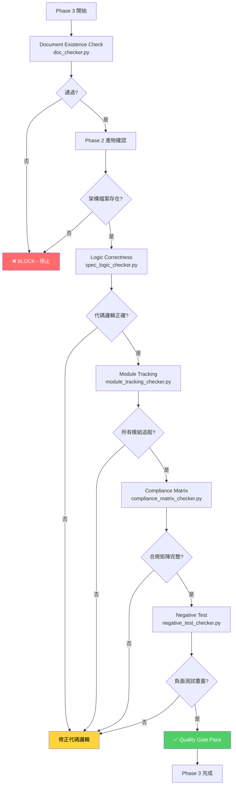
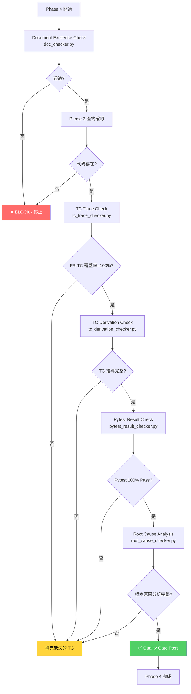
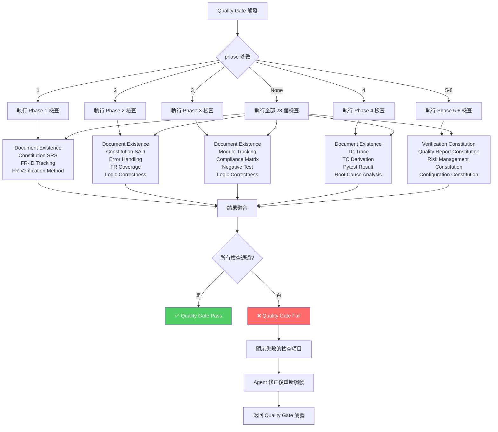
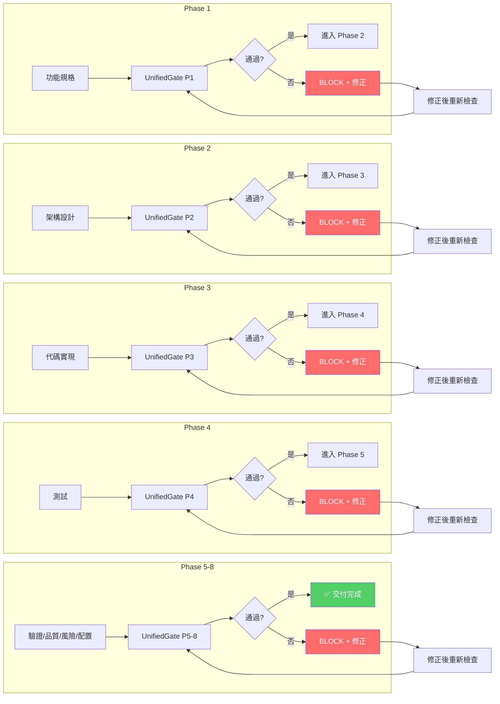

# methodology-v2 自動化檢查機制

> **版本**: v2.0 (2026-03-29)
> **維護者**: methodology-v2 開發團隊
> **目標讀者**: AI Agent、Developer、Reviewer

---

## 執行摘要

| 維度 | 數值 |
|------|------|
| **UnifiedGate 檢查總數** | 23 個 |
| **Phase 覆蓋** | Phase 1-8 全覆蓋 |
| **自動化率** | ~66% (15/23 為完全自動化) |
| **觸發模式** | 3 種（自動/被動/手動） |
| **入口點** | 統一使用 `UnifiedGate.check_all()` |

---

## 1. UnifiedGate 架構

### 1.1 總覽

UnifiedGate 是所有品質檢查的統一入口，整合三種檢查類型：

```
┌─────────────────────────────────────────────────────────────┐
│                    UnifiedGate                             │
├─────────────────────────────────────────────────────────────┤
│  1. Document Existence (doc_checker)                       │
│  2. Constitution Compliance (constitution/)                 │
│  3. Phase References (phase_artifact_enforcer)            │
│  4. Logic Correctness (spec_logic_checker)                 │
│  5-9. P0/P1 優先級工具 (fr_id_tracker, threat_analyzer...) │
│  10-13. Phase 5-8 Constitution Checkers                     │
└─────────────────────────────────────────────────────────────┘
```

### 1.2 Phase 參數邏輯

```python
check_all(phase=None)  # 執行全部 23 個檢查
check_all(phase=1)     # 執行 Phase 1 相關檢查
check_all(phase="5-8") # 執行 Phase 5-8 相關檢查
```

---

## 2. 23 個檢查完整清單

### Phase 1：功能規格（7 個檢查）

| # | 檢查名稱 | 工具檔案 | Pass 條件 | Trigger | 自動化 |
|---|---------|---------|----------|---------|--------|
| 1 | Document Existence | `doc_checker.py` | P1-1 | Phase 開始/結束 | ✅ |
| 2 | Constitution SRS 正確性 | `srs_constitution_checker.py` | P1-2 | Phase 結束 | ✅ |
| 3 | Constitution SRS 可維護性 | `srs_constitution_checker.py` | P1-3 | Phase 結束 | ✅ |
| 4 | SPEC_TRACKING.md 存在 | `spec_tracking_checker.py` | P1-4 | Phase 開始/結束 | ✅ |
| 5 | 規格完整性 | `spec_tracking_checker.py` | P1-5 | Phase 結束 | ✅ |
| 6 | FR-ID 追蹤 | `fr_id_tracker.py` | P1-5 | Phase 任意時刻 | ✅ |
| 7 | FR 驗證方法 | `fr_verification_method_checker.py` | P1-6 | Phase 結束 | ✅ |

### Phase 2：架構設計（6 個檢查）

| # | 檢查名稱 | 工具檔案 | Pass 條件 | Trigger | 自動化 |
|---|---------|---------|----------|---------|--------|
| 8 | Document Existence | `doc_checker.py` | P2-1 | Phase 開始/結束 | ✅ |
| 9 | Constitution SAD 正確性 | `sad_constitution_checker.py` | P2-2 | Phase 結束 | ✅ |
| 10 | Phase Artifact 存在 | `phase_artifact_enforcer.py` | P2-3 | Phase 結束 | ✅ |
| 11 | Error Handling | `error_handling_checker.py` | P2-10 | Phase 結束 | ✅ |
| 12 | FR Coverage | `fr_coverage_checker.py` | P2-7, P2-8 | Phase 結束 | ✅ |
| 13 | Logic Correctness | `spec_logic_checker.py` | P2-11 | Phase 結束 | ✅ |

### Phase 3：代碼實現（5 個檢查）

| # | 檢查名稱 | 工具檔案 | Pass 條件 | Trigger | 自動化 |
|---|---------|---------|----------|---------|--------|
| 14 | Document Existence | `doc_checker.py` | P3-1 | Phase 開始/結束 | ✅ |
| 15 | Module Tracking | `module_tracking_checker.py` | P3-1 | Phase 結束 | ✅ |
| 16 | Compliance Matrix | `compliance_matrix_checker.py` | P3-5 | Phase 結束 | ✅ |
| 17 | Negative Test | `negative_test_checker.py` | P3-7 | Phase 結束 | ✅ |
| 18 | Logic Correctness | `spec_logic_checker.py` | P3-8 | Phase 結束 | ✅ |

### Phase 4：測試（5 個檢查）

| # | 檢查名稱 | 工具檔案 | Pass 條件 | Trigger | 自動化 |
|---|---------|---------|----------|---------|--------|
| 19 | Document Existence | `doc_checker.py` | P4-1 | Phase 開始/結束 | ✅ |
| 20 | TC Trace | `tc_trace_checker.py` | P4-1, P4-9 | Phase 結束 | ✅ |
| 21 | TC Derivation | `tc_derivation_checker.py` | P4-2 | Phase 結束 | ✅ |
| 22 | Pytest Result | `pytest_result_checker.py` | P4-3, P4-4 | Phase 結束 | ✅ |
| 23 | Root Cause Analysis | `root_cause_checker.py` | P4-10 | Phase 結束 | ✅ |

### Phase 5-8：驗證/品質/風險/配置（各 1 個 Constitution 檢查）

| Phase | 檢查名稱 | 工具檔案 | Trigger | 自動化 |
|-------|---------|---------|---------|--------|
| 5 | Verification Constitution | `verification_constitution_checker.py` | Phase 結束 | ✅ |
| 6 | Quality Report Constitution | `quality_report_constitution_checker.py` | Phase 結束 | ✅ |
| 7 | Risk Management Constitution | `risk_management_constitution_checker.py` | Phase 結束 | ✅ |
| 8 | Configuration Constitution | `configuration_constitution_checker.py` | Phase 結束 | ✅ |

---

## 3. Phase 1-8 詳細流程圖

### 3.1 Phase 1：功能規格流程圖



### 3.2 Phase 2：架構設計流程圖



### 3.3 Phase 3：代碼實現流程圖



### 3.4 Phase 4：測試流程圖



### 3.5 Phase 5-8 統一流程圖

```mermaid
graph TD
    A[Phase N 開始] --> B[Document Existence Check<br/>doc_checker.py]
    B --> C{通過?}
    C -->|否| E[❌ BLOCK - 停止]
    C -->|是| F[Phase (N-1) 產物確認]
    F --> G{前期產物存在?}
    G -->|否| E
    G -->|是| H[Constitution Check - Phase N<br/>phase_N_constitution_checker.py]
    H --> I{Constitution 分數≥門檻?}
    I -->|否| J[修正 Constitution 內容]
    I -->|是| K[Artifact 完整性檢查]
    K --> L{產物完整?}
    L -->|否| J
    L -->|是| M[Pass 條件驗證]
    M --> N{所有 Pass 條件滿足?}
    N -->|否| J
    N -->|是| Q[✅ Quality Gate Pass]
    Q --> R[Phase N 完成]
    
    style E fill:#ff6b6b,color:#fff
    style Q fill:#51cf66,color:#fff
    style J fill:#ffd43b,color:#000
```

---

## 4. UnifiedGate 統一入口流程圖

### 4.1 入口點流程圖



### 4.2 Phase 全流程圖



---

## 5. 觸發時間點分類

### 5.1 Phase 開始時觸發

| 檢查 | 目的 | 工具 |
|------|------|------|
| Document Existence | 確認前期產物存在 | `doc_checker.py` |
| Phase References | 確認前 Phase 完成 | `phase_artifact_enforcer.py` |

### 5.2 Phase 結束時觸發

| 檢查 | 目的 | 工具 |
|------|------|------|
| Constitution Check | 所有 Phase 的 Constitution 合規 | 各 phase_N_constitution_checker.py |
| Logic Correctness | 代碼邏輯正確性驗證 | `spec_logic_checker.py` |
| 所有 Pass 條件檢查 | 確認 Phase 交付條件 | 各專門檢查器 |

### 5.3 任意時刻觸發

| 檢查 | 觸發方式 | 工具 |
|------|---------|------|
| FR-ID Tracking | 存檔時被動觸發 | `fr_id_tracker.py` |
| Test Coverage | 執行測試時 | `coverage_checker.py` |
| Issue Tracking | 問題出現時 | `issue_tracker.py` |
| Risk Status | 風險變化時 | `risk_status_checker.py` |

---

## 6. 自動化檢查矩陣

| 檢查 | P1 | P2 | P3 | P4 | P5 | P6 | P7 | P8 |
|------|:--:|:--:|:--:|:--:|:--:|:--:|:--:|:--:|
| Document Existence | ✅ | ✅ | ✅ | ✅ | ✅ | ✅ | ✅ | ✅ |
| Constitution Compliance | ✅ | ✅ | ✅ | ✅ | ✅ | ✅ | ✅ | ✅ |
| Phase References | - | ✅ | - | - | - | - | - | - |
| Logic Correctness | - | ✅ | ✅ | - | - | - | - | - |
| FR-ID Tracking | ✅ | - | - | - | - | - | - | - |
| FR Verification Method | ✅ | - | - | - | - | - | - | - |
| FR Coverage | - | ✅ | - | ✅ | - | - | - | - |
| Error Handling | - | ✅ | - | - | - | - | - | - |
| Module Tracking | - | - | ✅ | - | - | - | - | - |
| Compliance Matrix | - | - | ✅ | - | - | - | - | - |
| Negative Test | - | - | ✅ | - | - | - | - | - |
| TC Trace | - | - | - | ✅ | - | - | - | - |
| TC Derivation | - | - | - | ✅ | - | - | - | - |
| Pytest Result | - | - | - | ✅ | - | - | - | - |
| Root Cause Analysis | - | - | - | ✅ | - | - | - | - |
| Verification Constitution | - | - | - | - | ✅ | - | - | - |
| Quality Report Constitution | - | - | - | - | - | ✅ | - | - |
| Risk Management Constitution | - | - | - | - | - | - | ✅ | - |
| Configuration Constitution | - | - | - | - | - | - | - | ✅ |

---

## 6. 資料夾結構檢查機制（2026-03-29 新增）

### 6.1 概述

新增 `folder_structure_checker.py`，基於 PDF (All_Phases_Folder_Structure) 定義的預期資料夾結構進行檢查。

### 6.2 每 Phase 的資料夾結構預期

#### Phase 1 完成後
```
project-root/
├── 01-requirements/
│   ├── SRS.md (必要，含 FR)
│   ├── SPEC_TRACKING.md (必要)
│   └── TRACEABILITY_MATRIX.md (必要，FR 欄位已填)
├── quality_gate/
├── .methodology/decisions/
└── DEVELOPMENT_LOG.md (必要，含 Quality Gate 輸出)
```

#### Phase 2 完成後
```
project-root/
├── 01-requirements/ (前期產出，只讀)
├── 02-architecture/
│   └── SAD.md (必要，模組設計 + ADR)
├── quality_gate/
└── DEVELOPMENT_LOG.md (必要，含 Conflict Log)
```

#### Phase 3 完成後
```
project-root/
├── 01-requirements/
├── 02-architecture/
├── 03-implementation/
│   ├── src/ (必要，含 Python 檔案)
│   ├── tests/ (必要，正向 + 邊界 + 負面)
│   ├── scripts/spec_logic_checker.py (必要)
│   └── coverage_report/ (必要，pytest-cov 生成)
└── DEVELOPMENT_LOG.md (必要，含邏輯審查對話)
```

#### Phase 4 完成後
```
project-root/
├── 01-requirements/
├── 02-architecture/
├── 03-implementation/
├── 04-testing/
│   ├── TEST_PLAN.md (必要)
│   └── TEST_RESULTS.md (必要，含 pytest 輸出 + 失敗根本原因分析)
├── tests/ (可補充系統測試)
└── DEVELOPMENT_LOG.md (必要，含兩次 A/B 審查記錄)
```

### 6.3 產出物完整性檢查

| Phase | 檢查項目 | 工具 |
|-------|---------|------|
| P1 | 必要檔案存在 + SRS 含 FR + TRACEABILITY 已填 | `folder_structure_checker.py` |
| P2 | SAD 含模組設計 + ADR + Conflict Log | `folder_structure_checker.py` |
| P3 | src/tests 含 Python 檔案 + spec_logic_checker + coverage_report | `folder_structure_checker.py` |
| P4 | TEST_PLAN/TEST_RESULTS 含 pytest 輸出 + 根本原因分析 | `folder_structure_checker.py` |

### 6.4 整合進 UnifiedGate

```python
# 在 check_all() 中呼叫
gate = UnifiedGate(project_path)
result = gate.check_all(phase=1)  # 自動執行 folder_structure_check

# 或單獨檢查
result = gate.check_folder_structure_only(phase=2)
```

---

## 7. 統一入口 UnifiedGate 使用方式

### 7.1 Python API

```python
from quality_gate.unified_gate import UnifiedGate

# 初始化
gate = UnifiedGate(project_path="/path/to/project")

# 執行所有檢查
result = gate.check_all()

# 執行 Phase 1-4 檢查
result = gate.check_all(phase="1-4")

# 執行 Phase 5-8 檢查
result = gate.check_all(phase="5-8")

# 執行單一 Phase
result = gate.check_all(phase=3)

# 檢查結果
print(f"Passed: {result.passed}")
print(f"Score: {result.overall_score}")
print(f"Total Checks: {result.summary['total_checks']}")
print(f"Failed: {result.summary['failed_checks']}")
```

### 7.2 CLI 命令

```bash
# 執行所有檢查
python3 -m quality_gate.unified_gate check --all

# 執行 Phase 1-4 檢查
python3 -m quality_gate.unified_gate check --phase 1-4

# 執行 Phase 5-8 檢查
python3 -m quality_gate.unified_gate check --phase 5-8

# 執行單一 Phase
python3 -m quality_gate.unified_gate check --phase 3

# 個別工具直接執行
python3 quality_gate/tc_trace_checker.py --project-dir .
python3 quality_gate/fr_id_tracker.py --project-dir . --output report.json
```

### 7.3 便捷方法

```python
gate = UnifiedGate(project_path)

# 只檢查文檔存在性
result = gate.check_documents_only()

# 只檢查 Constitution 合規
result = gate.check_constitution_only()

# 只檢查 Phase 引用
result = gate.check_phase_only()

# 只檢查邏輯正確性
result = gate.check_logic_only()

# 只檢查 FR-ID
result = gate.check_fr_id_only()

# Phase 5-8 便捷方法
result = gate.check_verification_only()       # Phase 5
result = gate.check_quality_report_only()      # Phase 6
result = gate.check_risk_management_only()    # Phase 7
result = gate.check_configuration_only()       # Phase 8
```

---

## 8. 觸發點詳解

### 8.1 自動觸發（CLI）

```bash
# Quality Gate 完整檢查
python3 quality_gate/unified_gate.py --project-dir . --phase all

# Phase 特定檢查
python3 quality_gate/unified_gate.py --project-dir . --phase 1-4

# 單一檢查工具
python3 quality_gate/tc_trace_checker.py --project-dir .
python3 quality_gate/fr_id_tracker.py --project-dir . --output report.json
```

### 8.2 被動觸發（存檔監控）

```python
# quality_watch.py daemon 監控檔案變更
# 變更時自動執行相關檢查

import time
from pathlib import Path

def watch_and_check(project_path):
    """監控檔案變更並觸發檢查"""
    gate = UnifiedGate(project_path)
    last_check = 0
    
    while True:
        # 檢查最近變更的檔案
        now = time.time()
        if now - last_check > 60:  # 每分鐘最多一次
            result = gate.check_all()
            last_check = now
            
            if not result.passed:
                print(f"⚠️ Quality Gate Failed: {result.summary['failed_checks']} checks")
        time.sleep(10)
```

### 8.3 手動觸發（Human-in-the-Loop）

```bash
# Agent B 人工確認環節
python3 -m agent_evaluator --check APPROVE

# 手動執行單一檢查並等待人工確認
python3 quality_gate/tc_trace_checker.py --project-dir . --wait-confirm
```

---

## 9. 檢查工具詳細說明

### 9.1 FR-ID Tracker

```python
# 使用方式
from quality_gate.fr_id_tracker import FRIDTracker

tracker = FRIDTracker("/path/to/project")
result = tracker.scan()

# 輸出結構
{
    "passed": bool,
    "total_fr_ids": int,
    "tracked": int,
    "untracked": int,
    "details": [...],
    "untracked_ids": [...]
}
```

**Pass 條件**：所有 FR-ID 必須在架構、代碼、測試中都被引用

### 9.2 TC Trace Checker

```python
# 使用方式
from quality_gate.tc_trace_checker import TCTraceChecker

checker = TCTraceChecker("/path/to/project")
result = checker.check()

# 輸出結構
{
    "passed": bool,
    "coverage_rate": float,
    "total_fr": int,
    "covered_fr": int,
    "uncovered_fr": [...],
    "threshold": 100
}
```

**Pass 條件**：P4-1 和 P4-9 = 100% FR-TC 覆蓋率

### 9.3 Logic Correctness Checker

```python
# 使用方式
from scripts.spec_logic_checker import SpecLogicChecker

checker = SpecLogicChecker("/path/to/project")
result = checker.scan_python_files()

# 輸出結構
{
    "passed": bool,
    "score": float,
    "files_checked": int,
    "functions_checked": int,
    "issues": [...]
}
```

---

## 10. 故障排除

### 10.1 檢查失敗時的處理流程

```
Quality Gate Fail
    │
    ├── 查看失敗的檢查項目
    │   └── result.summary['failed_checks']
    │
    ├── 查看詳細的 violations
    │   └── for check in result.checks:
    │           if not check.passed:
    │               print(check.violations)
    │
    ├── 修正問題
    │   └── 根據 violation 提示修正
    │
    └── 重新觸發檢查
        └── gate.check_all()
```

### 10.2 工具不可用時的處理

```python
# UnifiedGate 會自動標記為 skipped
# 不會影響整體檢查結果

result = gate.check_all()
for check in result.checks:
    if check.details.get("status") == "skipped":
        print(f"{check.name}: skipped - {check.details.get('reason')}")
```

---

## 11. 版本歷史

| 版本 | 日期 | 更新內容 |
|------|------|---------|
| v1.0 | 2026-03-28 | 初始版本，13 個檢查 |
| v2.0 | 2026-03-29 | 擴展至 23 個檢查，Phase 5-8 支援 |

---

## 12. 相關文件

- [UnifiedGate 源碼](../quality_gate/unified_gate.py)
- [Pass Conditions 總表](./PASS_CONDITIONS.md)
- [Constitution 框架](./constitution/README.md)
- [Phase Artifact 定義](./phase_artifact_enforcer.py)