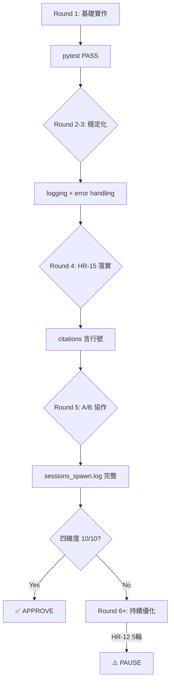

# Phase {PHASE} 執行計劃 — {PROJECT_NAME}

> **版本**: {VERSION}
> **專案**: {PROJECT_NAME}
> **日期**: {DATE}
> **Framework**: methodology-v2 {VERSION}
> **狀態**: 待 Johnny 確認啟動

---

## 0. 執行協議（§0）

```
[Step 0] READ state.json → current_phase={PHASE}
[Step 1] LOAD SKILL.md §4 Phase 路由
[Step 2] CHECK 進入條件 → blocker → STOP
[Step 3] EXECUTE SOP → LAZY LOAD docs/P{PHASE}_SOP.md
[Step 4] RECORD output | SPAWN A/B agent
[Step 5] CHECK 退出條件 → fail → FIX + RETRY
[Step 6] UPDATE state.json phase={PHASE_PLUS_1} → GOTO 1
```

**CLI 命令**：
```bash
python3 cli.py update-step --step N
python3 cli.py end-phase --phase {PHASE}
python3 cli.py stage-pass --phase {PHASE}
python3 cli.py run-phase --phase {PHASE} --goal "{GOAL}"
```

---

## 1. 硬規則（HR-01~HR-15）

| HR | 規則 | 後果 | 具體行動 |
|----|------|------|---------|
| HR-01 | A/B 不同 Agent，禁自寫自審 | 終止 -25 | Developer spawn → Reviewer spawn（嚴格順序）|
| HR-02 | Quality Gate 需實際命令輸出 | 終止 -20 | 每個 QG 保存 stdout |
| HR-03 | Phase 順序執行，不可跳過 | 終止 -30 | state.json phase={PHASE} |
| HR-04 | HybridWorkflow mode=ON，強制 A/B | 終止 | prompt 含 mode=ON |
| HR-05 | 衝突時優先 methodology-v2 | 記錄 | 爭議時 methodology-v2 為準 |
| HR-06 | 禁引入規格書外框架 | 終止 -20 | forbidden list |
| HR-07 | DEVELOPMENT_LOG 需記錄 session_id | -15 | 每筆記 session_id |
| HR-08 | Phase 結束需執行 Quality Gate | 終止 -10 | stage-pass --phase {PHASE} |
| HR-09 | Claims Verifier 驗證需通過 | 終止 -20 | citations 對照 |
| HR-10 | sessions_spawn.log 需有 A/B 記錄 | 終止 -15 | 每 step 2 筆記錄 |
| HR-11 | Phase Truth < 70% 禁進入下一 Phase | 終止 | <70% → PAUSE |
| HR-12 | A/B 審查 > 5 輪 → PAUSE | — | 達 5 輪主動停 |
| HR-13 | Phase 執行 > 預估 ×3 → PAUSE | — | 記 start_time |
| HR-14 | Integrity < 40 → FREEZE | — | QG 後查 Integrity |
| HR-15 | citations 必須含行號 + artifact_verification | -15 | 無 citations = 任務失敗 |

---

## 2. A/B 協作（HR-01, HR-04）

### On Demand / Need to Know 原則

| 原則 | 定義 |
|------|------|
| **Need to Know** | 只給必要資訊，L1/NFR 被問時才提供 |
| **On Demand** | Sub-agent 自己讀 artifact paths，不 dump |
| **職責單一** | 每個 Sub-agent 只做一個 FR |

### HR 約束（Phase {PHASE}）
{HR_LIST}

### TH 閾值（Phase {PHASE}）
{TH_LIST}

### A/B 角色（Phase {PHASE}）

| 角色 | Agent | 職責 |
|------|-------|------|
| **Agent A** | `{AGENT_A}` | 主要實作 |
| **Agent B** | `{AGENT_B}` | 審查驗證 |

### TH 閾值詳細

{TH_THRESHOLDS_TABLE}

---

## 3. FR-by-FR 任務表格（共 {FR_COUNT} 項）

{FR_TABLE_ROWS}

---

## 4. 產出結構樹

```
{DELIVERABLE_STRUCTURE}
```

> 📋 結構從 SAD.md §1.3 FR 需求對應表解析

### 交付物檢查清單

```markdown
## Phase {PHASE} 交付物

### 代碼產出
- [ ] `app/processing/` - 處理模組
- [ ] `app/synth/` - 合成模組
- [ ] `app/infrastructure/` - 基礎設施模組（如有）
- [ ] `app/api/` - API 路由（如有）

### 測試產出
- [ ] `tests/test_fr01*.py` - FR-01 測試
- [ ] `tests/test_fr02*.py` - FR-02 測試
- [ ] ...（共 {FR_COUNT} 個 FR）

### 文檔產出
- [ ] `AB_COLLABORATION.md` - Developer+Reviewer 協作記錄
- [ ] `sessions_spawn.log` - A/B session 完整記錄

### 驗證產出
- [ ] pytest 所有測試 PASS
- [ ] coverage ≥80%
- [ ] Phase Truth ≥70%

### Git 產出
- [ ] git push 完成
- [ ] remote 同步驗證
```

---

## 5. FR 詳細任務（共 {FR_COUNT} 項）

> ⚠️ FR 詳細任務需要解析 SRS.md §FR-XX
> 完整內容見 `.methodology/plans/phase{PHASE}_FULL.md`
> 若要生成詳細任務，加上 `--detailed` flag

{FR_DETAILED_TASKS}

---

## 6. 外部文檔

{EXTERNAL_DOCS}

---

## 7. Developer Prompt 模板（On Demand）

### Agent A（Developer）

```
{DEVELOPER_PROMPT}
```

### Agent B（Reviewer）

```
{REVIEWER_PROMPT}
```

```
═══════════════════════════════════════
TASK: FR-{FR_NUM} {MODULE_NAME}
TASK_ID: task-{FR_NUM_ZF}
═══════════════════════════════════════

PROMPT（自己讀）：
- SRS.md (§FR-{FR_NUM})
- 02-architecture/SAD.md (§Module 邊界對照表)

OUTPUT:
- {OUTPUT_FILE}
- {TEST_FILE}

FORBIDDEN:
- ❌ app/infrastructure/（已廢除）
- ❌ @covers: L1 Error → @covers: FR-{FR_NUM}
- ❌ @type: edge → positive/negative/boundary
- ❌ ... 省略 → 任務失敗

OUTPUT_FORMAT:
{{
 "status": "success|error|unable_to_proceed",
 "result": "實際產出",
 "confidence": 1-10,
 "citations": ["FR-{FR_NUM}", "SAD.md#L23-L45"],
 "summary": "50字內"
}}
═══════════════════════════════════════
```

---

## 8. Iteration 修復流程

### 四維度評核標準（目標 10/10）

| 維度 | 目標 | 關鍵動作 |
|------|------|---------|
| **規範符合度** | 10/10 | HR-15 citations（含行號）、docstring [FR-XX] |
| **A/B 協作** | 10/10 | sessions_spawn.log 完整、Developer↔Reviewer 記錄 |
| **子代理管理** | 10/10 | SubagentIsolator.spawn()、fresh_messages 隔離 |
| **測試覆蓋率** | 10/10 | pytest PASS + coverage ≥80% |

### 迭代策略（每個 FR）



### 每輪目標

| Round | 目標 | 交付物 |
|-------|------|--------|
| Round 1 | 基礎實作 | 代碼 + 測試 + pytest PASS |
| Round 2 | Production-ready | logging + error handling |
| Round 3 | 穩定化 | pytest 持續 PASS |
| Round 4 | HR-15 落實 | citations 含行號 |
| Round 5 | A/B 協作 | sessions_spawn.log 完整 |
| Round 6+ | 持續優化 | 直到四維度 10/10 |

### 終止條件

```
✅ 四維度全部 10/10 → APPROVE
⚠️ HR-12 5輪限制 → PAUSE（通知 Johnny）
⏰ HR-13 >3x 預估時間 → PAUSE（checkpoint）
```

**HR-12（5輪限制）**：
- Round 1-4: 正常修復繼續
- Round 5: ⚠️ HR-12 PAUSE，通知 Johnny

---


## 9. 工具調用時機（On Demand 觸發）

| 工具 | 觸發時機 | 調用方式 |
|------|---------|---------|
| **SubagentIsolator** | 派遣 Sub-agent 前 | `si.spawn(role=AgentRole.{AGENT_A_UPPER}, task="...")` |
| **PermissionGuard** | exec/rm 操作前 | `pg.check(Operation(type="exec", ...))` |
| **ContextManager** | context > 50 條訊息 | `cm.compress_if_needed()` |
| **SessionManager** | 任務 > 30 分鐘 | `sm.save("task-id", state)` |
| **KnowledgeCurator** | 派遣前驗證覆蓋率 | `kc.verify_coverage(fr_list=["FR-01"])` |
| **ToolRegistry** | 新工具引入時 | `tr.register("Tool", handler)` |

### On Demand 觸發條件

```
• SubagentIsolator → 每次派遣前（HR-01）
• PermissionGuard → exec/rm 前（安全檢查）
• ContextManager → context > 50 時自動壓縮
• SessionManager → 任務開始時 + 30 分鐘後自動 save
• KnowledgeCurator → Phase 開始前 verify
• ToolRegistry → 發現新工具時 register
```

{subagent_mgmt}

## 10. Quality Gate（Step 9）

### 依序執行，全部通過才能 APPROVE

```bash
{QG_COMMANDS}
```

---

## 11. sessions_spawn.log 格式（HR-10）

每個 FR 產生 2 筆記錄，共 {FR_COUNT} × 2 = {TOTAL_RECORDS} 筆記錄：

```json
{SESSION_LOG_EXAMPLE}
```

---

## 12. Commit 格式

```
[Phase {PHASE}] Step {N}: FR-{FR_NUM} {MODULE_NAME} (HASH)
```

範例：
```
[Phase {PHASE}] Step 1: FR-01 {MODULE_NAME} (a1b2c3d)
[Phase {PHASE}] Step 2: FR-02 {MODULE_NAME} (e4f5g6h)
...
```

---

## 13. 估計時間

| 階段 | 估計時間 |
|------|---------|
| Pre-execution | 10 分鐘 |
| FR-01 ~ FR-{FR_COUNT}（各 15-20 分鐘） | 120-160 分鐘 |
| Quality Gate | 30 分鐘 |
| **總計** | **約 3-3.5 小時** |

---

## 14. Phase Truth 組成

```
✅ FrameworkEnforcer BLOCK (權重 40%)
✅ Sessions_spawn.log (權重 20%)
✅ pytest 實際通過 (權重 20%)
✅ 測試覆蓋率達標 (權重 20%)
```

---

## 15. 工具速查

### SubagentIsolator
```python
from subagent_isolator import SubagentIsolator, AgentRole
si = SubagentIsolator()
result = si.spawn(role=AgentRole.DEVELOPER, task="FR-{FR_NUM}", artifact_paths=["SRS.md"])
```

### PermissionGuard
```python
from permission_guard import PermissionGuard
pg = PermissionGuard()
pg.check(Operation(type="exec", permission="EXEC_BASH", target="rm -rf /tmp"))
```

### KnowledgeCurator
```python
from knowledge_curator import KnowledgeCurator
kc = KnowledgeCurator()
kc.verify_coverage(fr_list=["FR-01", "FR-02"])
```

### ContextManager（三層壓縮）
```python
from context_manager import ContextManager
cm = ContextManager()
cm.compress_if_needed()  # L1>50, L2>100, L3>200
```

### SessionManager
```python
from checkpoint_manager import SessionManager
sm = SessionManager()
sm.save("fr{FN}-impl", state_dict)
```

### ToolRegistry
```python
from tool_registry import ToolRegistry
tr = ToolRegistry()
tr.register("NewTool", handler)
```

---

## 16. Pre-Execution Checklist

```
□ state.json 已初始化（phase={PHASE}, step=0）
□ sessions_spawn.log 已清空重建
□ KnowledgeCurator.verify_coverage() 已執行
□ ContextManager.create_task() 已執行（{FR_COUNT} 個 task）
□ Artifact paths 已確認
□ Forbidden 事項已定義
□ 產出格式已定義
□ sessions_spawn.log 已寫入第一筆記錄（spawn 前）
□ state.json 已更新
□ 長期任務已 session-save（如超過 30 分鐘）
□ 新工具已 ToolRegistry.register（如有引入）
□ DEVELOPMENT_LOG 已更新（Phase {PHASE} 開始）
```

---

## 17. 下一步

```bash
# Johnny 審核後，執行：
python3 cli.py run-phase --phase {PHASE} --goal "{GOAL}"

# 或修復特定步驟：
python3 cli.py plan-phase --phase {PHASE} --repair --step {PHASE}.2 --goal "{GOAL}"

# 生成完整 FR 詳細任務（需要 SRS.md）：
python3 scripts/generate_full_plan.py --phase {PHASE} --repo /path/to/project
```

---

*本計劃依 SKILL.md {VERSION} + P{PHASE}_SOP.md {VERSION} 生成*
