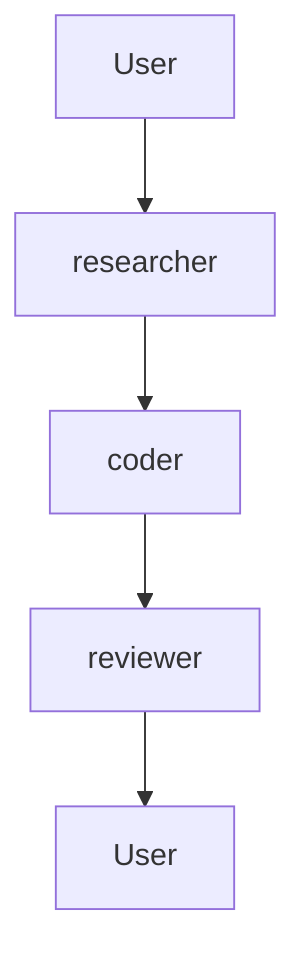
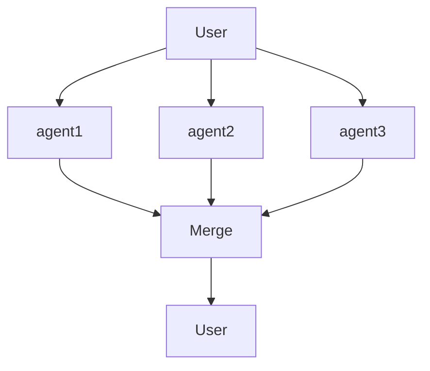
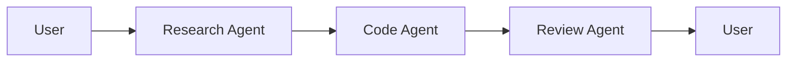
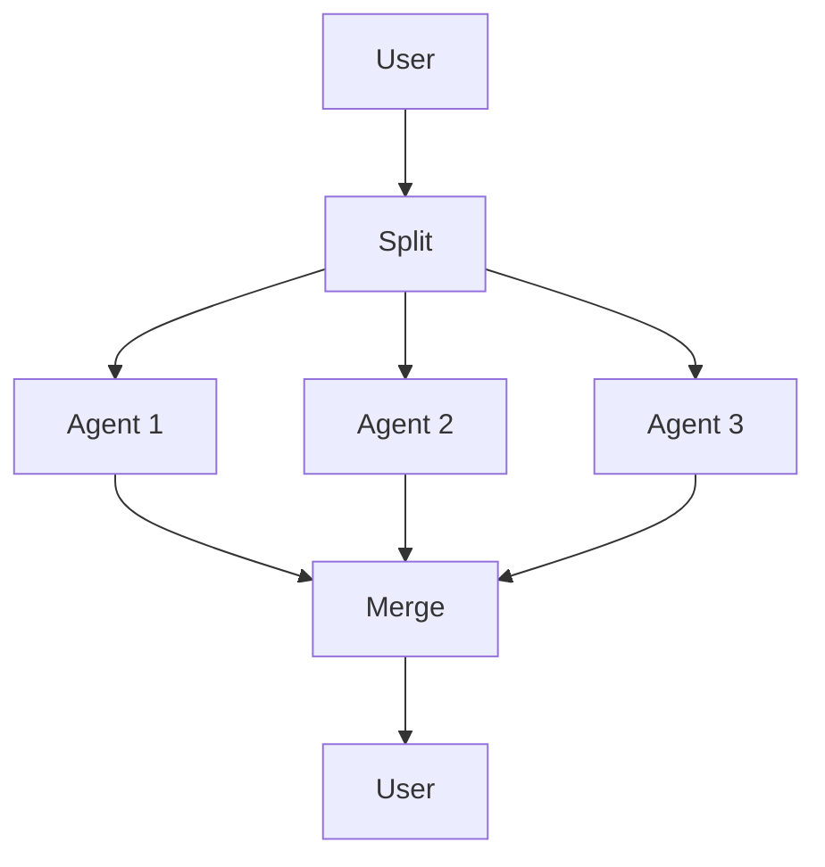

# Workflow Visualizer

Visualize and debug multi-agent workflows for methodology-v2.

## Quick Start

```python
import sys
sys.path.insert(0, '/workspace/methodology-v2')
sys.path.insert(0, '/workspace/workflow-visualizer/scripts')

from workflow_visualizer import WorkflowVisualizer, ExecutionTracer

# Visualize workflow
viz = WorkflowVisualizer()
mermaid_code = viz.generate_diagram(
    agents=["researcher", "coder", "reviewer"],
    process="sequential"
)
print(mermaid_code)

# Trace execution
tracer = ExecutionTracer()
tracer.start_task("research", {"query": "AI trends"})
tracer.start_task("coder", {"task": "write code"})
tracer.end_task("research", {"result": "found data"})

# Generate trace diagram
trace_diagram = tracer.visualize()
print(trace_diagram)
```

## Features

| Feature | Description |
|---------|-------------|
| Mermaid Generator | Generate workflow diagrams |
| Execution Tracer | Track agent execution steps |
| Timeline View | Show parallel/sequential timing |
| State Machine | Visualize agent states |
| Debug View | Highlight bottlenecks |

## Diagram Types

### 1. Workflow Diagram

```python
viz = WorkflowVisualizer()
diagram = viz.generate_diagram(
    agents=[
        {"name": "researcher", "role": "research"},
        {"name": "coder", "role": "code"},
        {"name": "reviewer", "role": "review"}
    ],
    process="sequential"
)
```

Output:


### 2. Parallel Process

```python
diagram = viz.generate_diagram(
    agents=["agent1", "agent2", "agent3"],
    process="parallel"
)
```

Output:


### 3. Hierarchical Process

```python
diagram = viz.generate_diagram(
    agents=[
        {"name": "coordinator", "role": "orchestrate"},
        {"name": "worker1", "role": "execute"},
        {"name": "worker2", "role": "execute"}
    ],
    process="hierarchical"
)
```

### 4. Execution Trace

```python
tracer = ExecutionTracer()

# Track execution
tracer.start("research", {"query": "AI"})
tracer.start("coder", {"spec": "..."})
tracer.end("research", {"data": "..."})

# Generate trace
trace = tracer.visualize(format="mermaid")
print(trace)
```

## Integration with methodology-v2

```python
from methodology import Crew
from workflow_visualizer import WorkflowVisualizer

# Create Crew
crew = Crew(agents=[...], process="sequential")

# Visualize before execution
viz = WorkflowVisualizer()
print(viz.generate_diagram_from_crew(crew))

# Trace execution
tracer = ExecutionTracer()
tracer.trace_crew(crew)
print(tracer.get_timeline())
```

## CLI Usage

```bash
# Generate diagram
python workflow_visualizer.py diagram --agents a,b,c --process sequential

# Visualize execution trace
python workflow_visualizer.py trace --log execution.log

# Real-time monitoring
python workflow_visualizer.py monitor --port 8080
```

## Visualization Options

### Theme

```python
viz = WorkflowVisualizer(theme="dark")
viz = WorkflowVisualizer(theme="light")
```

### Layout

```python
viz = WorkflowVisualizer(layout="top-down")
viz = WorkflowVisualizer(layout="left-right")
```

### Styling

```python
viz.set_agent_style("coder", color="green", shape="rectangle")
viz.set_edge_style("success", color="green", style="solid")
viz.set_edge_style("failed", color="red", style="dashed")
```

## Real-time Monitoring

```python
from workflow_visualizer import WorkflowMonitor

monitor = WorkflowMonitor(port=8080)

@monitor.agent_event
def on_agent_event(event):
    print(f"Agent {event.agent} {event.action}")

monitor.start()
```

## Output Formats

| Format | Description | Use Case |
|--------|-------------|----------|
| mermaid | Mermaid diagram code | Documentation |
| dot | GraphViz DOT | Complex diagrams |
| json | JSON structure | API integration |
| html | Interactive HTML | Web embedding |
| png | PNG image | Presentations |

## Example Outputs

### Sequential Flow


### Parallel Flow


### Execution Timeline

```mermaid
gantt
    title Agent Execution Timeline
    dateFormat X
    axisFormat %s
    
    Research : 0, 2
    Code : 2, 5
    Review : 5, 7
```


## Debug Features

### Bottleneck Detection

```python
tracer = ExecutionTracer()
# ... run tasks ...

bottlenecks = tracer.find_bottlenecks()
print(bottlenecks)
# [{'agent': 'reviewer', 'avg_time': 30s, 'issues': ['slow']}]
```

### Error Highlighting

```python
tracer.mark_error("coder", "Syntax error in line 42")
diagram = tracer.visualize(highlight_errors=True)
```

## See Also

- [references/mermaid_cheatsheet.md](references/mermaid_cheatsheet.md)
- [references/diagram_examples.md](references/diagram_examples.md)
